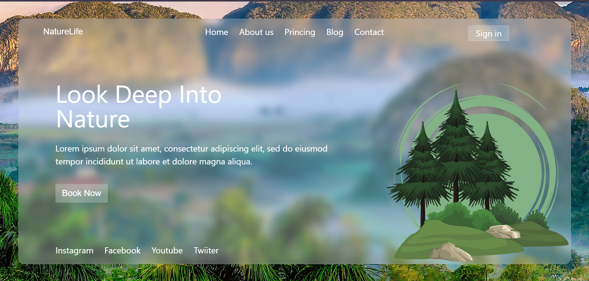

# Natureza

Esse projeto tinha como objetivo, nos apresentar o Tailwind CSS, e aprender a utilizar ele no projeto.

Descriçao: Uma página com uma imagem de fundo, e alguns componentes, como textos, botões e imagem.

# Tecnologias Utilizadas
-HTML
-Tailwind CSS 
-Figma 

link figma: https://www.figma.com/design/frqbnhETmShvuCEq6OOxfj/lima---natureza--Copy-?node-id=2103-2&t=uTJxExmpu6MVyz6P-0

# Autor 
Giovana barbosa souza